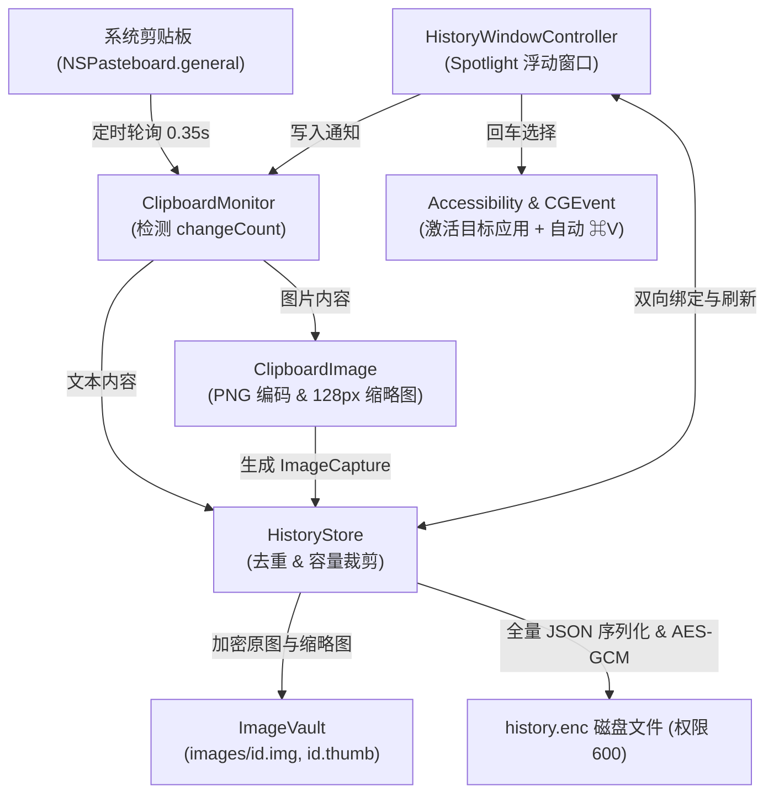

# ClipTiny 剪贴板项目可优化点调研与演化方案

> 本文档针对当前 **ClipTiny** 架构实现、运行性能、用户体验与系统级集成进行深度调研与梳理，提供体系化的技术演进建议。

---

## 1. 项目现状与既有优势

### 1.1 技术栈与架构边界

- **纯原生技术栈**：采用 Swift + 原生 AppKit 构建，最低适配版本 macOS 26，无任何第三方第三方框架依赖，产物体积极致轻量。
- **Spotlight 风格界面**：窗口主体采用 `NSGlassEffectView` 原生液态玻璃材质，支持自适应系统深浅色外观。
- **端到端本地加密**：历史记录不落地明文，采用 CryptoKit AES-GCM 加密，主密钥由 macOS 钥匙串托管。
- **无障碍文本光标感知**：具备无障碍状态机重试与焦点检测（`AXUIElement`），支持回车直接写回剪贴板并向目标应用自动发送 `⌘V`。

### 1.2 数据流拓扑

---

## 2. 性能与存储 I/O 优化（高优先级）

### 2.1 存储持久化：全量同步主线程写入 ➔ 异步增量/防抖落盘

- **问题现状**：
  在 [`HistoryStore.swift`](Sources/ClipTiny/HistoryStore.swift) 的 `save()` 中，每次添加记录（[`store.add()`](Sources/ClipTiny/HistoryStore.swift)）均在**主线程**同步执行以下操作：
  1. 对全部 `items`（最多 500 条）执行 `JSONEncoder().encode(items)`；
  2. 运行 `AES.GCM.seal` 对全量 JSON 进行对称加密；
  3. 执行原子写盘 `encrypted.write(to: fileURL, options: .atomic)`。
  
  高频复制（如短时间内连续复制多段文本或多行日志）会导致主线程微卡顿，并在磁盘产生密集的瞬时整块 I/O。
- **优化方案**：
  - **I/O 移出主线程**：使用 Swift Concurrency（`actor` 或后台 `Task.detached`），将 JSON 编码、加密和磁盘写盘派发至后台并发队列。
  - **防抖合并写盘（Debounced Save）**：内存列表与 UI 即时响应，将文件写盘操作进行 500ms~1000ms 的防抖合并，高频复制只在停止变动后写入一次。
  - **优雅退出保证**：在 `applicationWillTerminate` 或窗口隐藏时立即触发一次同步写盘 flush，确保无数据丢失。

### 2.2 图片捕获与缩略图生成异步化

- **问题现状**：
  [`ClipboardMonitor.swift`](Sources/ClipTiny/ClipboardMonitor.swift) 触发 `readIfChanged()` 时，调用了 [`ClipboardImage.read()`](Sources/ClipTiny/ClipboardImage.swift)，其中 `NSBitmapImageRep` 解码、128px 重采样绘制、PNG 格式编码、SHA-256 哈希计算以及 `ImageVault` 写入均在**主线程**同步完成。用户复制大图（如 10MB~20MB 的 4K 截图）时会有肉眼可见的系统主线程卡顿。
- **优化方案**：
  - 在主线程仅读取剪贴板的原始图片数据（`pasteboard.data(forType:)`）；
  - 将图像转码、缩略图生成、哈希计算及磁盘加密写入全流程转移至后台任务；
  - 写入成功后回派主线程更新 `HistoryStore.items` 并触发界面无缝增量刷新。

### 2.3 剪贴板轮询节能策略（自适应退避与休眠暂停）

- **问题现状**：
  当前以固定 0.35s 间隔循环轮询 `pasteboard.changeCount`。在系统空闲无操作、屏幕休眠或锁屏状态下，应用依然不断唤醒 CPU，影响能耗表现。
- **优化方案**：
  - **休眠监听**：监听 `NSWorkspace.screensDidSleepNotification` 和 `screensDidWakeNotification`，屏幕关闭时立即暂停定时器，唤醒时重置。
  - **自适应退避（Adaptive Backoff）**：
    利用 `CGEventSource.secondsSinceLastEventType(.combinedSessionState, ...)` 检测用户最近输入时间：
    - 活跃状态（< 1 分钟）：0.35s 轮询；
    - 低频状态（1~5 分钟）：1.0s 轮询；
    - 空闲状态（> 5 分钟）：2.0s 轮询，一旦检测到用户键盘或鼠标事件立即切回 0.35s。

---

## 3. 核心交互与生产力体验升级

### 3.1 单条记录删除（重大体验/隐私痛点补齐）

- **问题现状**：
  目前只支持在菜单栏“清空历史”（一键删除全部）。若用户意外复制了个人密码、Token、私钥等敏感文本，无法单独移除单条记录，只能彻底清空所有历史。
- **优化方案**：
  - 在 `HistoryStore` 新增 `delete(id: UUID)`，同时删除对应的原图及缩略图文件；
  - 在 `KeyboardTableView` 及搜索框中监听 `⌘⌫`（Cmd+Backspace）或 `Delete` 键，触发删除当前选中行；
  - 表格通过 `tableView.removeRows(at:withAnimation: .effectFade)` 呈现平滑删除动画，并自动选中临近项。

### 3.2 快捷数字直达粘贴（`⌥1` ~ `⌥9`）

- **问题现状**：
  打开窗口后必须通过方向键或鼠标选中目标项再按回车。主流工具（Maccy / Raycast / Paste）均支持数字键直达粘贴。
- **优化方案**：
  - 在全局面板中捕获 `⌥1` ~ `⌥9`（Option + 1~9）快捷键，直接将对应第 1 到第 9 项写回剪贴板并触发自动粘贴；
  - 列表单元格右侧提供小尺寸物理键帽徽标（`KeycapBadgeView`）提示数字快捷键，直观指引。
  - *(注：实际落地与视觉审查后，为保持列表界面极致简洁、避免与特定按键修饰符冲突，已按决策移除此特性，保留回车及焦点移动操作)*

### 3.3 常用记录置顶与收藏（Pin / Favorite）

- **问题现状**：
  当前数据完全受最大条目限制（50/100/200/500），高频使用的命令行参数、邮箱地址、固定模板易被后续连续复制挤出历史。
- **优化方案**：
  - `HistoryItem` 增加 `isPinned: Bool` 属性；
  - `HistoryStore.trim()` 进行容量截断时跳过所有置顶项；
  - 界面提供快捷键 `⌘P` 切换置顶状态，置顶项排序常驻列表头部，并带有图钉语义图标。

### 3.4 纯文本粘贴（格式去除粘贴模式）

- **优化方案**：
  - 快捷键 `⌥Enter`（Option+Enter）提供“粘贴为纯文本”或“去除前后首尾空白粘贴”；
  - 对于带复杂制表符或换行缩进的富文本，自动合并多余空行，提升代码/配置编辑体验。

### 3.5 搜索升级：中文拼音首字母匹配与多词 AND 搜索

- **问题现状**：
  当前采用 `localizedCaseInsensitiveContains` 进行简单的子串匹配。
- **优化方案**：
  - **拼音首字母搜索**：中文剪贴板最显著的提效功能。例如输入 `wz` 可直接命中 `网址`、`网站`，无需频繁切换中文输入法；
  - **空格多词拆分（AND 匹配）**：输入 `swift table` 可同时匹配包含这两个词的任意长文本。

### 3.6 唤起位置策略偏好

- **问题现状**：
  目前窗口只在上次位置恢复或屏幕居中显示。
- **优化方案**：
  - 提供三种唤起位置设置项：
    1. **居中显示 / 记忆位置**（当前 Spotlight 模式，适合大屏固定位置习惯）；
    2. **鼠标指针附近跟随**（在当前鼠标光标所在的显示器中心或指针下方唤出，视线迁移成本最低）；
    3. **焦点输入框跟随**（通过 AXUIElement 读取当前光标插入点坐标并在下方展开）。

---

## 4. 内容扩展、安全与系统集成

### 4.1 内容类型拓展：Finder 文件 / 文件夹支持

- **问题现状**：
  在 Finder 中复制文件或文件夹时，剪贴板类型为 `public.file-url`，当前被当成空内容跳过或作为路径字符串处理。
- **优化方案**：
  - 增加 `HistoryKind.file`；
  - 采集时解析 `pasteboard.readObjects(forClasses: [NSURL.self], options: nil)`；
  - 列表与预览区利用 `NSWorkspace.shared.icon(forFile:)` 绘制文件真实系统图标，展示文件名、路径与体积；
  - 针对文件记录支持 `⌘R`（Reveal in Finder）直接在访达中定位高亮。

### 4.2 应用黑名单机制（密码管理器/敏感应用防误录）

- **问题现状**：
  当前仅通过三种通用 PasteboardType 过滤（`TransientType`、`ConcealedType`、`AutoGeneratedType`）。但许多特定终端、网页版凭证库或未适配标志的应用仍可能将敏感信息泄露至剪贴板。
- **优化方案**：
  - 支持配置“排除应用名单”（App Blacklist）；
  - 复制事件触发时，结合 `NSWorkspace.shared.frontmostApplication?.bundleIdentifier` 进行校验，若处于黑名单应用则立即放弃记录。

### 4.3 敏感 Token / 密码智能脱敏展示

- **优化方案**：
  - 正则扫描常见敏感凭证特征（如 `ghp_`、`sk-`、`AKIA...` 等 API Key 或成段密码）；
  - 列表中默认打码展示（如 `ghp_••••••••8a9b`），右侧预览提供“明文眼睛切换”按钮，避免在共享屏幕或演示时意外泄露私密数据。

### 4.4 开机自动启动能力（`SMAppService`）

- **问题现状**：
  作为后台常驻工具，目前缺失开机自启动配置，重启系统后需要手动在 Finder 打开。
- **优化方案**：
  - macOS 13+ / macOS 26 原生推荐使用 `SMAppService.mainApp`，无需任何额外的 Helper 子程序即可在菜单栏直接加入“开机启动”复选框，完全符合原生沙盒与系统设置规范。

---

## 5. 代码架构与工程质量演进

### 5.1 拆分庞大的 `HistoryWindowController.swift`（>1140 行）

- **问题现状**：
  单个 Controller 承担了：Panel 键盘事件拦截、搜索逻辑、表格代理、无障碍光标检测与重试逻辑、CGEvent 注入、5 种预览卡片组装。
- **优化方案**：
  - **抽离 `PasteService`**：将 `focusedElementTextStatus`、`pasteWhenCursorAvailable`、`postPasteShortcut` 封装为独立的无障碍自动化服务类；
  - **抽离 `HistoryPreviewViewController` / `HistoryPreviewView`**：将右侧文本、图片、颜色、链接预览的装配从主控制器中解耦出来；
  - **Controller 职责聚焦**：仅负责整体布局协调与窗口可见性生命周期。

### 5.2 全面拥抱 Swift Concurrency（Swift 6 模式准备）

- **优化方案**：
  - `HistoryStore` 的数据读写与落盘采用 `actor StorageEngine` 隔离，避免多线程访问竞争；
  - UI 交互层明确标记 `@MainActor`，消灭显式的 `DispatchQueue.main.async`。

---

## 6. 实施优先级与路线图

| 阶段 | 优化项 | 价值 / 收益 | 复杂度 | 核心受影响模块 |
| :--- | :--- | :--- | :--- | :--- |
| **P0 (即时落地)** | **单条记录删除 (`⌘⌫`)** | 消除敏感内容无法单独抹除的重大隐私痛点 | 低 | `HistoryStore`, `HistoryWindowController` |
| **P0 (即时落地)** | **存储持久化异步与防抖落盘** | 消除高频复制时的主线程 I/O 卡顿 | 低 | `HistoryStore` |
| **P0 (即时落地)** | **开机自动启动 (`SMAppService`)** | 常驻工具核心必备能力 | 极低 | `AppDelegate` |
| **P1 (核心增强)** | **快捷数字直达粘贴 (`⌥1`~`⌥9`)** | 显著提升高频使用者的击键效率 | 低 | 已按需求排除，保持界面纯粹 |
| **P1 (核心增强)** | **中文拼音首字母搜索** | 极大改善中文输入环境下的查找体验 | 中 | `HistoryWindowController` |
| **P1 (核心增强)** | **重要常用条目置顶 (`⌘P`)** | 核心文本/命令片段持久保存，不被容量截断 | 中 | `HistoryStore`, `HistoryRowView` |
| **P1 (核心增强)** | **图片转码后台化与大图保护** | 杜绝复制高分辨率截图时的系统瞬时卡顿 | 中 | `ClipboardImage`, `ClipboardMonitor` |
| **P2 (架构与扩展)** | **`HistoryWindowController` 解耦** | 代码解耦与可测试性提升 | 中 | `HistoryWindowController` |
| **P2 (架构与扩展)** | **Finder 文件/文件夹复制支持** | 扩展剪贴板适用边界 | 中 | `ClipboardMonitor`, `HistoryRowView` |
| **P2 (架构与扩展)** | **敏感应用黑名单配置** | 强化企业/个人密码管理器的私密保护 | 低 | `ClipboardMonitor`, `AppDelegate` |
| **P2 (架构与扩展)** | **自适应节能与休眠感知轮询** | 进一步降低后台运行能耗与发热 | 低 | `ClipboardMonitor` |
